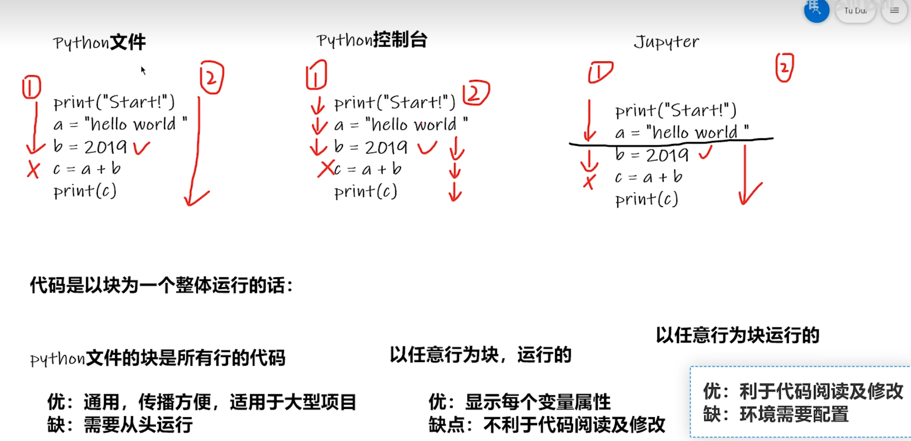
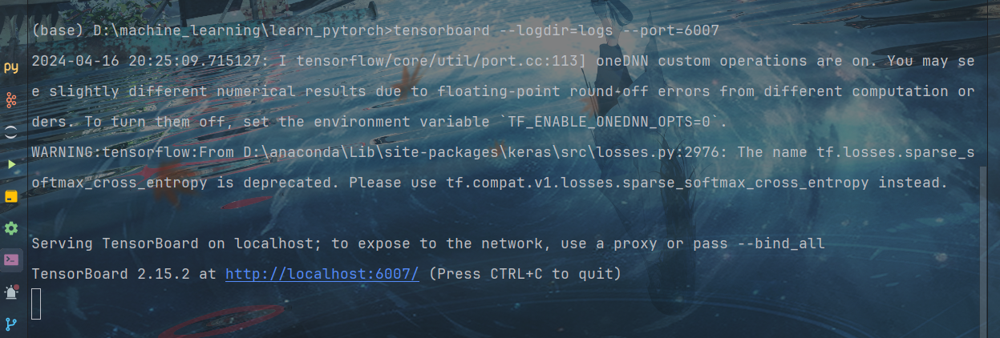

# pycharm与jupyter notebook 的比较

# pytorch数据初识
## Dateset
 Dataset提供一种方式去获取每个数据及其对应的label，告诉我们总共有多少个数据。

## Dateloader
Dataloader为后面的网络提供不同的数据形式，它将一批一批数据进行一个打包。

## 常用数据集两种形式
① 常用的第一种数据形式，文件夹的名称是它的label。

② 常用的第二种形式，lebel为文本格式，文本名称为图片名称，文本中的内容为对应的label。

# TensorBoard的使用

